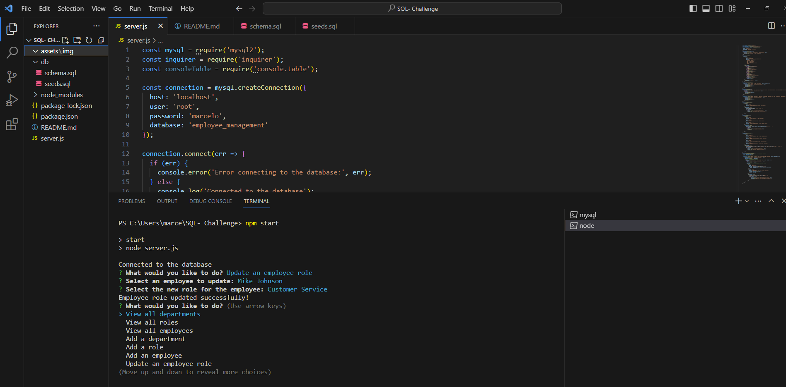

# Employee Management Database (Module 12)

## Description

This app is a command-line interface for managing employee data within a MySQL database. It enables users to view departments, roles, and employees, as well as add new departments, roles, and employees. Additionally, users can update an employee's role using interactive prompts.

Walktrough video url: https://drive.google.com/file/d/1BgoJqfwDbmYtD8wW6QYoCgFtMbpRE90p/view

### Credits

Completion of the project was done with the help of Tutors
